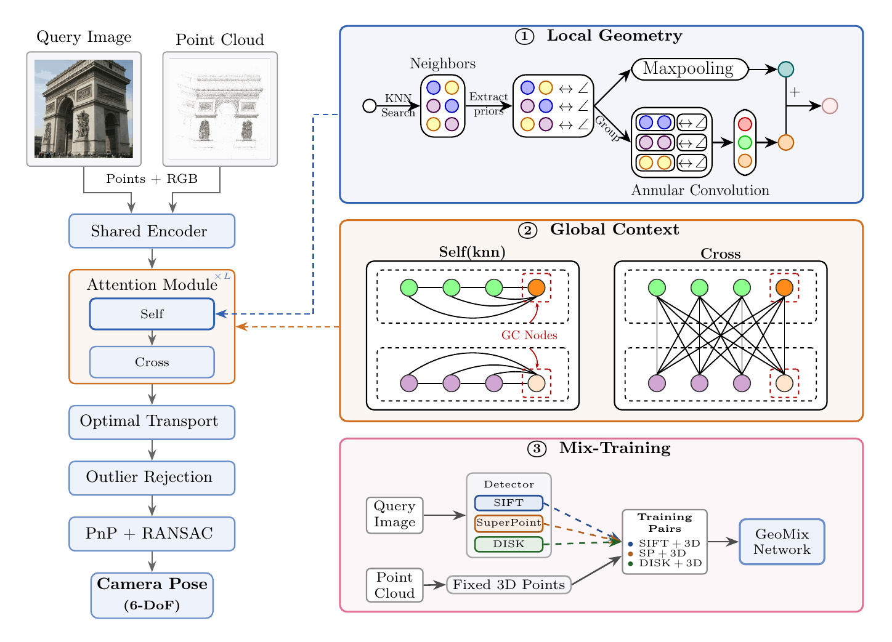

# [ECCV 2026] GeoMix: Descriptor-Free Visual Localization via Global Context and Multi-Detector Training

Authors: [Yejun Zhang](https://yejunzhang.github.io), [Xinjue Wang](https://xnnjw.github.io/), Zihan Wang, [Esa Rahtu](https://esa.rahtu.fi/), and [Juho Kannala](https://users.aalto.fi/~kannalj1/)

[[arXiv](https://arxiv.org/abs/2607.02486)]

GeoMix is a descriptor-free 2D-3D matching framework for visual localization. Building on [A2-GNN](https://github.com/YejunZhang/a2-gnn), it adds directional and distance-aware local embeddings, learnable global context nodes (`--num_registers`), and a Mix-Training strategy over multiple keypoint detectors (SIFT + SuperPoint + DISK).



## Environment Setup

```
git clone https://github.com/YejunZhang/Geomix.git
cd Geomix
conda env create -f environment.yml
conda activate geomix
```

We need to install the corresponding ```torch_scatter=2.0.8```

```
wget https://data.pyg.org/whl/torch-1.8.0%2Bcu111/torch_scatter-2.0.8-cp37-cp37m-linux_x86_64.whl
pip install torch_scatter-2.0.8-cp37-cp37m-linux_x86_64.whl
```

Now install GeoMix

```
pip install . --find-links https://data.pyg.org/whl/torch-1.8.0+cu11.1.html
```

## Data Preparation

We build on the data format of [GoMatch](https://github.com/dvl-tum/gomatch) / [DGC-GNN](https://github.com/AaltoVision/DGC-GNN-release). The DGC-GNN release [here](https://drive.google.com/drive/folders/1ae8CHU42wTJleRrlG9GBY4V-PIdqsM0O?usp=sharing) provides the processed MegaDepth base data (scene files, 3D points, and the SIFT keypoint cache); 7Scenes / Cambridge Landmarks are processed with the [GoMatch tools](https://github.com/dvl-tum/gomatch/tree/main/tools). Put everything under the data root (default `data/`, see `configs/datasets.yml`):

```
data/
├── MegaDepth_undistort/            # training + matching evaluation
└── gomatch_data/                   # 7scenes / cambridge
```

Mix-Training and cross-detector evaluation additionally need SuperPoint / DISK caches (train+val+test) and R2D2 / DeDoDe caches (test only, zero-shot evaluation), which are generated with [tools/extract_features.py](tools/extract_features.py):

```
python tools/extract_features.py --detector superpoint --splits train val test
python tools/extract_features.py --detector disk --splits train val test
```

See [tools/README.md](tools/README.md) for details and the R2D2 / DeDoDe commands.

## Training & Evaluation

The pretrained Mix-Training model is included as ```geomix_best.ckpt```.

```
# Train on MegaDepth (Mix-Training: SIFT + SuperPoint + DISK)
sh train.sh

# Eval on MegaDepth with each detector
sh eval.sh
```

Visual localization on Cambridge Landmarks / 7Scenes uses the same entrypoint, e.g.:

```
python -m geomix_eval.benchmark --root_dir . --ckpt geomix_best.ckpt \
    --dataset cambridge_sift --splits kings --p2d_type superpoint \
    --covis_k_nums 10 --odir outputs/eval/cambridge
```

with `--dataset` in `{megadepth, cambridge_sift, 7scenes_sift_v2, 7scenes_superpoint_v2}`.

### Aachen Day-Night

Aachen is processed and evaluated with an [hloc](https://github.com/cvg/Hierarchical-Localization)-based pipeline (`eval_aachen.py`): it extracts local features, retriangulates the reference 3D model with the chosen detector (so the 2D and 3D sides use the same detector type), matches query keypoints to the retrieved 3D points with GeoMix, and writes predicted poses in the [visuallocalization.net](https://www.visuallocalization.net/) submission format.

Download the [Aachen Day-Night dataset](https://www.visuallocalization.net/datasets/) to `data/aachen` (images, `3D-models`, `aachen.db`, queries) and the retrieval pairs `pairs-db-covis20.txt` / `pairs-query-netvlad50.txt` from [hloc pairs/aachen](https://github.com/cvg/Hierarchical-Localization/tree/master/pairs/aachen) to `data/aachen/pairs`, then with hloc installed:

```
python eval_aachen.py --detector_2d sift --detector_3d sift
python eval_aachen.py --detector_2d superpoint --detector_3d superpoint
```

## License

This project is released under the [MIT License](LICENSE).

## Acknowledgements

We appreciate the previous open-source repository [GoMatch](https://github.com/dvl-tum/gomatch), [DGC-GNN](https://github.com/AaltoVision/DGC-GNN-release), [A2-GNN](https://github.com/YejunZhang/a2-gnn) and [CLNet](https://github.com/sailor-z/CLNet).

## Citation

Please consider citing our papers if you find this code useful for your research:

```
@inproceedings{zhang2026geomix,
      title={GeoMix: Descriptor-Free Visual Localization via Global Context and Multi-Detector Training},
      author={Yejun Zhang and Xinjue Wang and Zihan Wang and Esa Rahtu and Juho Kannala},
      booktitle={European Conference on Computer Vision (ECCV)},
      year={2026},
}

@inproceedings{zhang2025a2gnn,
      title={A2-GNN: Angle-Annular GNN for Visual Descriptor-free Camera Relocalization},
      author={Yejun Zhang and Shuzhe Wang and Juho Kannala},
      booktitle={International Conference on 3D Vision (3DV)},
      year={2025},
}
```
